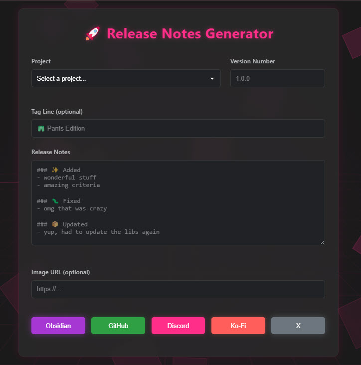

# Release Notes Generator 📝

Simple web app for generating formatted release notes with support for multiple platforms. Designed to be used with projects from jparkerweb 😆.

## Features 🚀

- **Multiple Output Formats**
  - Discord-formatted release notes
  - GitHub release notes
  - Ko-Fi updates
  - X (Twitter) updates
  - Obsidian notes with CSS styling

- **Project Management**
  - Predefined project list
  - Support for multiple project types:
    - NPM packages
    - Obsidian plugins
    - Demo links
    - GitHub repositories

- **Smart Validation**
  - Semantic version validation
  - HTTPS URL validation
  - Required field checks

- **Modern UI**
  - Dark mode with neon accents
  - Animated background
  - Responsive design
  - Copy to clipboard functionality
  - Form reset option



## Usage 💡

1. Select your project from the dropdown
2. Enter the version number (e.g., 1.0.0)
3. (Optional) Add a tag line - a brief description that appears at the top of your release notes
4. Write your release notes using the following format:
   ```markdown
   ### 🫧 Added
   - new feature one
   - new feature two

   ### 🐛 Fixed
   - bug that was fixed

   ### 📦 Updated
   - dependency updates
   ```
5. (Optional) Add an image URL
6. Choose your output format:
   - Generate for Obsidian (includes CSS snippet)
   - Generate for Discord
   - Generate for GitHub
   - Generate for Ko-Fi
   - Generate for X
7. Click on the generated notes to copy to clipboard
8. Reset the form when done

## Release Notes Structure 📋

The release notes consist of three main parts:
1. **Version Header** - Automatically formatted based on project and version
2. **Tag Line** (Optional) - A brief description or highlight of the release
3. **Change List** - Categorized list of changes

The change list follows a specific format:
- Section headers start with `### ` followed by an emoji and section name
- Each item starts with a `-` bullet point
- Common sections:
  - 🫧 Added (new features)
  - 🐛 Fixed (bug fixes)
  - 📦 Updated (dependency updates)
  - 🎨 Changed (modifications)
  - 🗑️ Removed (removed features)

The generator will format these into platform-specific outputs with consistent styling.

## Project Configuration 🔧

Projects can be configured with the following properties:

```javascript
{
    displayName: '🚀 Project Name',
    shortName: 'project-name',
    npmPackageName: 'package-name',     // Optional
    obsidianPluginName: 'Plugin Name',  // Optional
    demo: 'https://demo.url'           // Optional
}
```

## Development 👨‍💻

This is a vanilla JavaScript application with no external dependencies. To run locally:

1. Clone the repository
2. Open `index.html` in your browser
3. Start generating release notes!

## License 📜

MIT License

Copyright (c) 2024 Justin Parker
